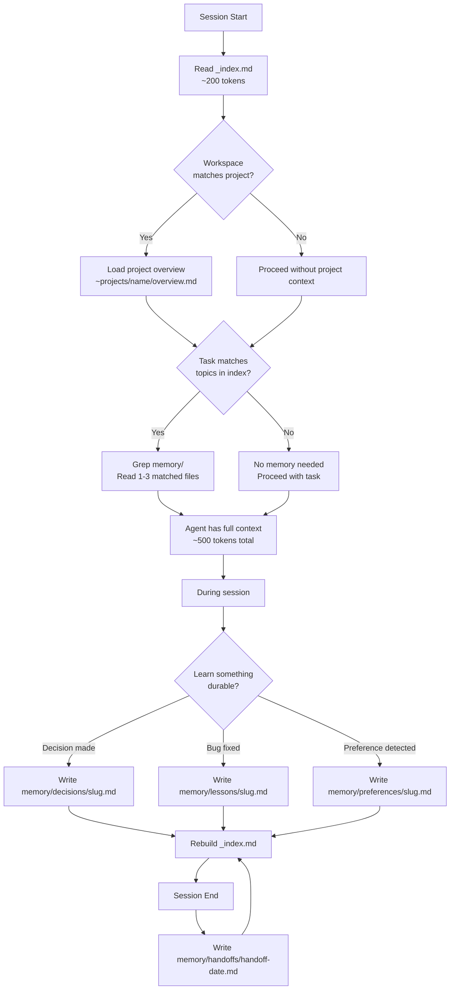

# Memory System — Zero-Dependency Persistent Memory for AI Coding Agents

[](LICENSE)
[](https://opencode.ai)
[]()

**A lightweight markdown-based memory system that gives AI coding agents persistent memory across all projects and sessions. No databases. No servers. No API keys. No npm packages. Just files.**

## The Problem

Every AI coding session starts with amnesia. Your agent doesn't know:

- What architecture decision you made last week
- That you prefer composition over inheritance
- Which model keeps forgetting to run tests
- What bug you fixed yesterday and how
- That you work across Godot, Unreal, and web projects

You end up repeating yourself. Every. Single. Session. The agent wastes time rediscovering what you already taught it, or worse — makes the same mistakes again.

ChatGPT doesn't remember you. Claude Code forgets between projects. Cursor starts fresh every time. OpenCode boots with a blank slate.

## The Solution

A global markdown memory bank with a lightweight index that the agent reads at session start. It uses the same tools the agent already has — read files, grep, write files — with zero extra infrastructure.



## Architecture

```
~/.opencode/memory/
  _index.md                  ← The map — all topics, projects at a glance (~200 tokens)
  decisions/                 ← Architecture/technical decisions (global)
  lessons/                   ← Bugs found, patterns learned, gotchas (global)
  preferences/               ← Coding style, workflow rules, requirements (global)
  handoffs/                  ← Session-end summaries
  projects/
    olamma/
      overview.md             ← Project context, stack, key decisions
      decisions/              ← Olamma-specific decisions
      lessons/                ← Olamma-specific lessons
    your-project/
      overview.md
      decisions/
      lessons/
```

### Why This Architecture

| Concern | How We Solve It |
|---|---|
| **Boot speed** | Only `_index.md` is read at boot (~200 tokens). Detail files loaded on demand. |
| **Cross-project awareness** | Global index lists ALL projects. LLM sees the map before drilling into a specific project. |
| **Project isolation** | Each project has its own `decisions/` and `lessons/`. Olamma bugs don't pollute Godot context. |
| **Global preferences** | Coding rules and workflow preferences live at the top level. Applied everywhere. |
| **Search** | `grep -r "keyword" ~/.opencode/memory/` — instant, no search engine needed. |
| **Portability** | Plain markdown. Works with OpenCode, Claude Code, Cursor, any agent that reads files. |
| **Zero infrastructure** | No Node.js process, no MCP server, no API keys, no Docker, no database. |

## Comparison

| | Memory System | RLM | Mem0 | Claude Auto-Memory | ClawMem |
|---|---|---|---|---|---|
| **Dependencies** | 0 | Node.js + MCP | Docker + Postgres + API key | Claude-only | Bun + llama.cpp + GPU |
| **Boot time** | ~5ms | ~90ms (was 30s timeout) | 10-30s (Docker) | Instant | 2-10s (GPU) |
| **Global + per-project** | Yes | No | No | No | No |
| **Cross-agent** | Yes | No | Yes | No | Yes |
| **Offline** | Yes | Yes | No (needs LLM API) | Yes | Yes |
| **Storage** | Markdown files | NDJSON | Postgres + pgvector | Single MEMORY.md | SQLite + embeddings |
| **Search** | grep + LLM | TF-IDF | Semantic + BM25 + entity | Sequential read | Hybrid RAG |

## Setup (5 minutes)

```bash
# 1. Clone the skill
git clone https://github.com/cvmgxd/memory-system.git

# 2. Create memory directories
mkdir -p ~/.opencode/memory/{decisions,lessons,preferences,handoffs,projects,templates}

# 3. Copy templates
cp memory-system/templates/*.md ~/.opencode/memory/templates/

# 4. Copy commands (optional, for slash commands)
cp memory-system/commands/*.md .opencode/commands/

# 5. Add the Memory Protocol to ~/.config/opencode/AGENTS.md
# (see SKILL.md for the full protocol block)

# 6. Create initial _index.md
cp memory-system/templates/_index.md ~/.opencode/memory/_index.md

# 7. Create your first project
mkdir -p ~/.opencode/memory/projects/my-project
echo "# My Project" > ~/.opencode/memory/projects/my-project/overview.md
```

## Core Concepts

### The Index (`_index.md`)

The boot-time cheat sheet. Always under 500 tokens. The agent reads this first and knows everything that exists in memory. It shows:

- **Topics**: Tag clusters with entry counts and summaries
- **Recent**: Last 10 entries by date
- **Projects**: Every project with a link to its overview

### Auto-Write

No commands to remember. The agent detects when something durable happened and saves it:

- Made an architecture decision → `decisions/`
- Fixed a non-trivial bug → `lessons/`
- You expressed a preference → `preferences/`
- Session ending → `handoffs/`

### Slash Commands

| Command | Purpose |
|---|---|
| `/memory save` | Scan session for anything worth saving |
| `/memory index` | Rebuild `_index.md` from all memory files |
| `/memory handoff` | End-of-session summary |

### Entry Format

Every memory file follows a simple convention:

```markdown
# Kind: Title here

> YYYY-MM-DD | kind | tag1, tag2, tag3

## Context / Why
...

## Content / Decision / What happened
...

## Impact / Prevention / Applies to
...
```

**Kinds**: `decision` | `lesson` | `preference` | `handoff` | `note` | `bug`

**Tags**: lowercase, space-separated. Use project names, tech stack keywords, topic descriptors.

## Keywords

AI agent memory, persistent memory, coding agent, OpenCode memory, Claude Code memory, Cursor memory, agent context, long-term memory, cross-session memory, project memory, AI coding assistant, developer memory, knowledge retention, memory bank, markdown memory, zero-dependency memory, local-first memory, AGENTS.md, agent instructions, agent skills, coding workflow, software engineering, AI pair programming.

## License

MIT — free to use, modify, and distribute.

## Author

Built for OpenCode by [@cvmgxd](https://github.com/cvmgxd)
